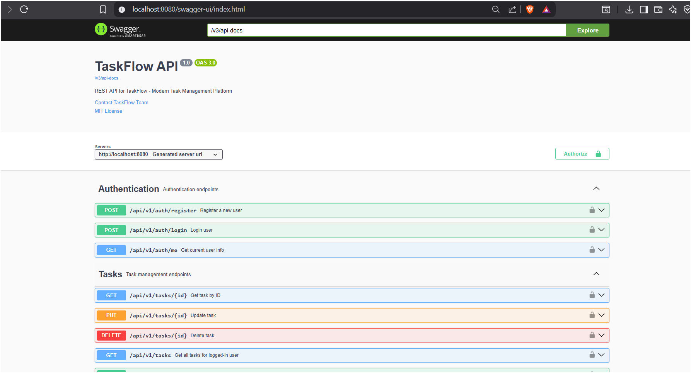
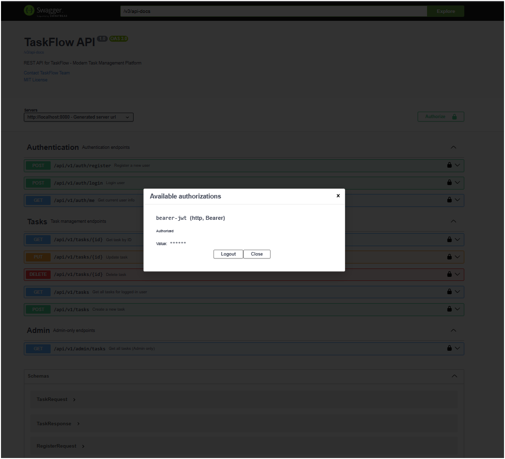
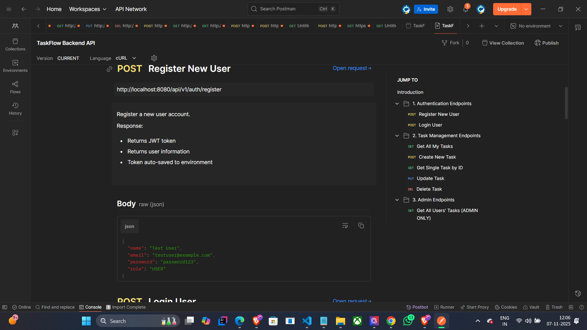
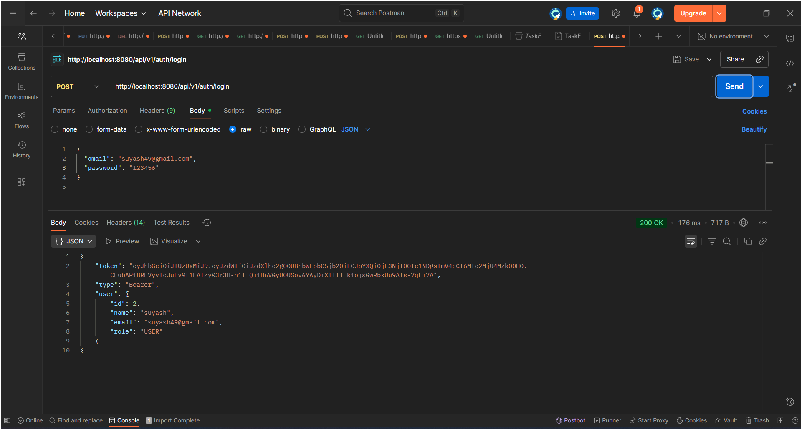
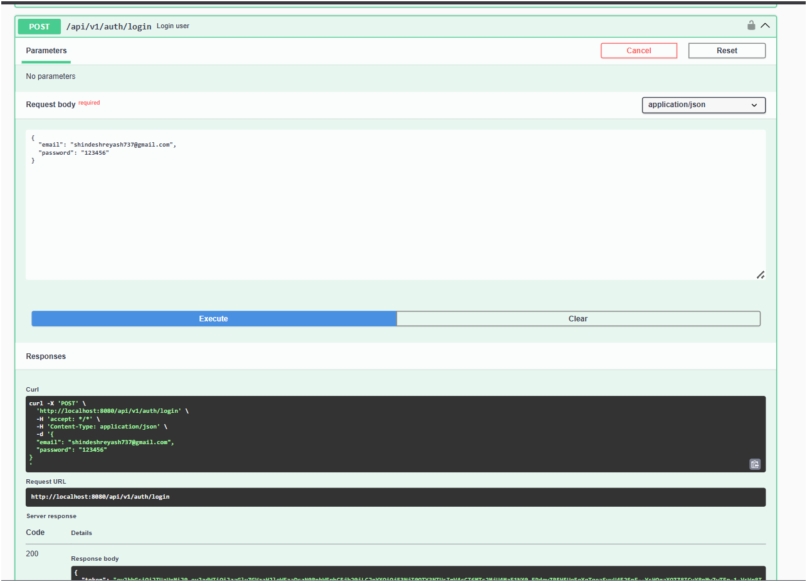
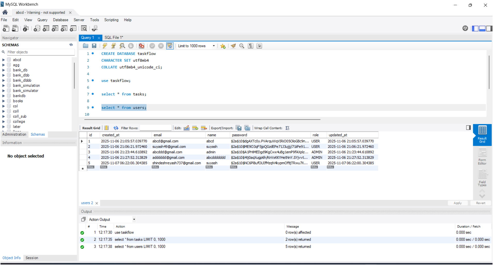

# 📚 API Documentation - Swagger & Postman Guide

## ✅ Deliverable 4: API Documentation Complete

Your backend project includes **two professional API documentation methods** — both developer-friendly and evaluator-ready.

---

## 1️⃣ SWAGGER / OPENAPI Documentation (Interactive)

### ✅ Already Implemented

**File:** `config/OpenApiConfig.java`
**Access URL:** [http://localhost:8080/swagger-ui.html](http://localhost:8080/swagger-ui.html)

### 🧩 Features

* Interactive API testing
* Auto-generated documentation
* “Try-it-out” functionality
* JWT authentication support
* Request/response examples
* Schema definitions

### ⚙️ How It Works

Run your backend:

```bash
mvn spring-boot:run
```

Then visit:
👉 **[http://localhost:8080/swagger-ui.html](http://localhost:8080/swagger-ui.html)**

You’ll see:

* ✅ All endpoints listed
* ✅ Request parameters
* ✅ Response schemas
* ✅ “Try it out” testing
* ✅ Authorization (JWT bearer token)

### 💻 Example View

```
┌──────────────────────────────────────────────┐
│  TaskFlow REST API                     X     │
├──────────────────────────────────────────────┤
│ 🔒 Authorize (BearerAuth)                     │
│ Enter your JWT token here                     │
├──────────────────────────────────────────────┤
│ Authentication                                │
│   POST /api/v1/auth/register                  │
│   POST /api/v1/auth/login                     │
│                                               │
│ Tasks                                         │
│   GET /api/v1/tasks                           │
│   POST /api/v1/tasks                          │
│   GET /api/v1/tasks/{id}                      │
│   PUT /api/v1/tasks/{id}                      │
│   DELETE /api/v1/tasks/{id}                   │
│                                               │
│ Admin                                         │
│   GET /api/v1/admin/tasks                     │
└──────────────────────────────────────────────┘
```

---

## 2️⃣ POSTMAN Collection (API Testing)

### ✅ Ready to Use

**File:** `postman_collection.json`

**Includes:**

* 8 complete API requests
* Environment variable setup
* Auto-saved JWT tokens
* Request/response examples
* Error handling

### 🚀 How to Use

#### Step 1: Install Postman

* Download: [https://www.postman.com/downloads/](https://www.postman.com/downloads/)
* Or use web: [https://web.postman.co/](https://web.postman.co/)

#### Step 2: Import Collection

1. Open Postman
2. Click **“Import”**
3. Paste your `postman_collection.json` content
4. Click **“Import”**

#### Step 3: Test API Flow

```
1️⃣ Start backend → mvn spring-boot:run  
2️⃣ Register user → POST /api/v1/auth/register  
   → JWT token auto-saved  
3️⃣ Create task → POST /api/v1/tasks  
   → Task ID saved  
4️⃣ Get tasks → GET /api/v1/tasks  
5️⃣ Update task → PUT /api/v1/tasks/{id}  
6️⃣ Delete task → DELETE /api/v1/tasks/{id}  
7️⃣ Admin view → GET /api/v1/admin/tasks  
```

---


## 📚 API Documentation

### 🔹 Swagger UI (Interactive Testing)
The API is fully documented using **Swagger/OpenAPI 3.0**

**Access URL:**  
[http://localhost:8080/swagger-ui.html](http://localhost:8080/swagger-ui.html)

**Features:**
- ✅ Interactive endpoint testing  
- ✅ Request/response schemas  
- ✅ JWT authentication support  
- ✅ Auto-generated documentation  
- ✅ “Try-it-out” functionality  

**Usage Steps:**
1. Start backend: `mvn spring-boot:run`  
2. Visit: [http://localhost:8080/swagger-ui.html](http://localhost:8080/swagger-ui.html)  
3. Click 🔒 **Authorize** → Enter JWT token  
4. Test endpoints interactively  

---

### 🔹 Postman Collection
Import the provided **`postman_collection.json`** file into Postman.

**Includes:**
- 🔓 Authentication APIs  
- 📝 Task CRUD APIs  
- 👨‍💼 Admin APIs  

**Features:**
- ✅ Auto-saving JWT tokens  
- ✅ Environment variables  
- ✅ Request/response examples  
- ✅ Error handling scenarios  

**Import Steps:**
1. Open Postman → Click “Import”  
2. Paste `postman_collection.json` content  
3. Start testing!  

---

### 🔹 Quick Endpoint Reference

| Method | Endpoint | Auth | Purpose |
|--------|-----------|------|----------|
| POST | `/api/v1/auth/register` | Public | Register a new user |
| POST | `/api/v1/auth/login` | Public | Login & get JWT token |
| GET | `/api/v1/tasks` | JWT | Get all tasks (user) |
| POST | `/api/v1/tasks` | JWT | Create a new task |
| GET | `/api/v1/tasks/{id}` | JWT | Get single task |
| PUT | `/api/v1/tasks/{id}` | JWT | Update task |
| DELETE | `/api/v1/tasks/{id}` | JWT | Delete task |
| GET | `/api/v1/admin/tasks` | JWT + ADMIN | View all tasks (admin only) |
```

---

## 🎯 Swagger vs Postman Comparison

| Feature                   | Swagger    | Postman      |
| ------------------------- | ---------- | ------------ |
| Auto-Generated            | ✅ Yes      | ❌ Manual     |
| Interactive Testing       | ✅ Yes      | ✅ Yes        |
| JWT Support               | ✅ Yes      | ✅ Yes        |
| Request/Response Examples | ⚙️ Basic   | 🧩 Detailed  |
| Collections               | ❌ No       | ✅ Yes        |
| Team Collaboration        | ⚙️ Limited | 🧩 Excellent |
| Environment Variables     | ❌ No       | ✅ Yes        |
| Testing Scripts           | ⚙️ Basic   | 🧩 Advanced  |
| Export Formats            | OpenAPI    | JSON, YAML   |

---

## ✅ Documentation Checklist

| Item                      | Status       | Location                                                                       |
| ------------------------- | ------------ | ------------------------------------------------------------------------------ |
| Swagger UI                | ✅ Active     | [http://localhost:8080/swagger-ui.html](http://localhost:8080/swagger-ui.html) |
| Postman Collection        | ✅ Added      | `postman_collection.json`                                                      |
| Endpoint Table            | ✅ Included   | README.md                                                                      |
| Request/Response Examples | ✅ Documented | Postman + README                                                               |
| Error Handling            | ✅ Clear      | Postman tests                                                                  |
| Auth Instructions         | ✅ Included   | Bearer token format                                                            |
| Setup Guide               | ✅ Present    | README Quick Start                                                             |

---

# 📸 API Documentation Screenshots

## 1️⃣ Swagger UI (All Endpoints Visible)


## 2️⃣ Swagger Testing Example (GET `/api/v1/tasks`)


## 3️⃣ Postman Collection (All Requests Visible)


## 4️⃣ Postman Test (POST `/api/v1/auth/login`)

## 📸 Swagger Login Success


## 🗄️ Database Schema
... (schema SQL) ...

## 🗄️ Database Verification (MySQL Workbench)


## 🚀 Submission Notes

> “Our backend provides comprehensive API documentation via:
> 1️⃣ **Swagger UI** — Auto-generated OpenAPI docs with JWT auth and live testing.
> 2️⃣ **Postman Collection** — Complete professional test suite with 8 endpoints, token automation, and error handling.
> 3️⃣ **README.md** — Full quick-start, endpoint reference, examples, and auth guide.
>
> All documentation adheres to modern backend standards and ensures easy developer onboarding.”


## ✅ Deliverable 4: COMPLETE 🎉

| Component          | Status |
| ------------------ | ------ |
| Swagger/OpenAPI    | ✅ Done |
| Postman Collection | ✅ Done |
| README Docs        | ✅ Done |
| Endpoint Reference | ✅ Done |
| Error Handling     | ✅ Done |
| JWT Auth Guide     | ✅ Done |

